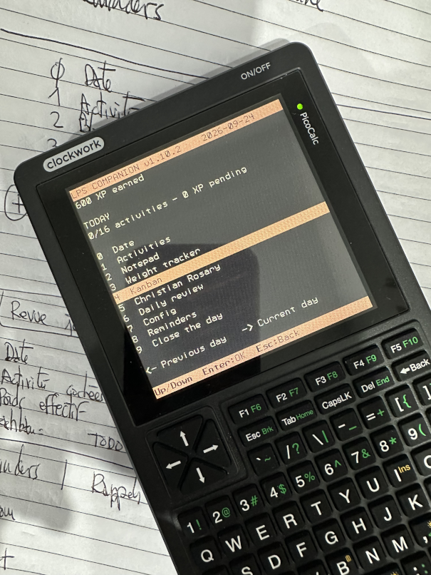

# LPS-Companion v1.7

**A pocket-sized daily activity tracker for the PicoCalc.**



LPS-Companion helps you record daily activities, write a short note, and compare your expected and actual weight. Completing activities earns experience points (XP) and unlocks collectible keepsakes.

It runs offline on the original **RP2040 PicoCalc**, with a **320 × 320 display** and physical keyboard. Your entries and progress are saved to the SD card.

**Status:** v1.2 was confirmed working on the user's PicoCalc. v1.7 adds a persistent Kanban and two activities; see `BUILD-VALIDATION.md` for host checks and physical-test limits.

## Changes in v1.7

- Added **Lecture / Reading** as activity 15.
- Added **Shopping** as activity 16 in both languages.
- Both activities appear on the second Activities page and are included in XP totals and calendar exports.
- Added a persistent **Kanban** for up to 24 user-defined tasks, each with a 32-character name.
- Tasks move between **TODO / À FAIRE**, **DOING / EN COURS**, and **DONE / FINI** and may be renamed, deleted or reordered.
- Kanban displays contextual key reminders and always opens on TODO / À FAIRE.
- **5 Config** remains unchanged; **Close the day / Terminer le jour** moves to item **6**.

The save format is now version 5. Existing version 1–4 saves import with an empty Kanban. Back up the complete SD-card `LPS` directory before updating; older firmware cannot read a save after v1.7 has rewritten it.

## Changes in v1.6

- A cold start without an SD card displays a **bold red** **`[!] Missing SD card!`** warning and blocks writes. English is used because the saved language preference cannot be read while the card is absent.
- Main and selection menus use consecutive rows for a denser, faster-to-scan layout.
- Activities now show **10 entries per page**; Weekend, Sortie/Outing, Jeu/Gaming and Docteur/Doctor appear on the second page.
- ICS descriptions use RFC 5545 newline escapes, so activities, XP, weights and note import as separate lines in calendar applications.

## Changes in v1.5

- **5 Config → 2 Colors / Couleurs** opens a live palette preview. Its labels follow the active language: **red/green/blue** in English or **rouge/vert/bleu** in French.
- **PAL1** is red/rouge, **PAL2** is green/vert (**default**), and **PAL3** is blue/bleu.
- Use Up/Down or `1`–`3` to preview a palette across the complete interface. Press **Enter** to save it immediately; the full screen is redrawn in the new palette. Esc returns to Configuration without saving the preview.
- Existing v1.4 saves import unchanged and retain the default green palette until a colour is chosen.

## Changes in v1.4

- **0 Date** is a new current-day menu entry in both languages.
- The field is pre-filled as `YYYY-MM-DD`. New profiles begin with the build's suggested date, **2026-09-17**; imported v1.0–v1.3 entries are explicitly undated until you confirm Date.
- The built-in Gregorian calendar covers **2000-01-01 through 2099-12-31**, including leap years. No separate calendar file is needed on the SD card: the rules are compiled into the firmware, so there is no extra file to corrupt or maintain.
- Closing a dated day automatically gives the new day the next valid calendar date.
- Closing a dated day also appends its weight values to `LPS/WEIGHTS/YYYY.csv` on the SD card. The columns are `date,expected_kg,measured_kg`; an unrecorded weight is left blank. Repeating a failed close does not duplicate the date.
- Every successfully closed dated day writes `LPS/EXPORT/YYYY-MM-DD_LPS-Companion.ics` to the SD card. It is a standard all-day calendar event containing activities, day XP/total XP, recorded weights, and note.

Closing is blocked until Date is valid. ICS export happens before the A/B snapshot is committed: a failed export leaves the day open and removes its incomplete ICS file. If the snapshot write fails after a successful export, retrying replaces that same date-named export; it never creates a duplicate event.

**Back up the entire SD `LPS` folder before updating.** v1.0–v1.3 cannot read the new format. Old history remains viewable but is marked undated; past entries are never exported retrospectively.

## Changes in v1.3

- **English** is the default for new profiles and imported v1.0–v1.2 saves.
- **5 Config → 1 Language** offers **English** and **Français**.
- Choose a language with Up/Down and Enter (or 1/2), then use **3 Save / 3 Enregistrer** in Configuration. The language takes effect only after a successful save.
- Esc from Language returns to Configuration without selecting the highlighted choice. Esc from Configuration discards unsaved changes.
- Device labels, activity names, help text, errors and keepsake names are translated. Proper names such as Gurumed and user-authored notes remain unchanged.
- The language survives restart and is stored in the protected A/B snapshots alongside your daily data.
- Old saves load automatically without losing activities, notes, weights, XP or history. The first successful save writes format 2, adding one language byte. Mixed old/new snapshots are supported during upgrade.

**Back up the entire SD `LPS` folder before updating.** v1.0–v1.2 cannot read the new format; restore your pre-upgrade backup if downgrading. Fallback to an older v1.2 snapshot also returns the language to English.

## Changes in v1.2

- On the home screen, **Left** steps back one saved day. Press again to go further back, up to the 31 retained completed days.
- On the home screen, **Right** returns directly to the current day.
- Past days are marked **JOUR ARCHIVE - LECTURE SEULE**. Open Activities, Note or Weight to inspect that day's entries. Historical entries cannot be edited or closed again.
- **Esc** returns to the selected day's menu. In Activities, Left/Right still switches activity pages; return to the menu before navigating days.
- The existing save format is unchanged: v1.0/v1.1 history loads automatically. Browsing never writes either save file or awards XP.

## Changes in v1.1

- Repas renamed to **Régime**.
- **Congé** and **Weekend** added.
- The **Pour demain** screen and its navigation removed.
- **Terminer le jour** is now menu item **4**.
- Existing v1.0 saves load without conversion. The previous Repas checkbox becomes Régime; all other existing activity positions are retained.

Back up the SD card’s `LPS` folder before updating. New activity flags are not supported by v1.0; restore your backup if reverting to that version.

## Build

### Requirements

- Original PicoCalc with a Raspberry Pi Pico/Pico H (RP2040).
- FAT16- or FAT32-formatted SD card.
- Linux development computer; the instructions below use Fedora.
- Internet access for the first build to download dependencies.

### Install the Fedora build tools

```bash
sudo dnf install git cmake ninja-build gcc-c++ python3 \
  arm-none-eabi-gcc-cs arm-none-eabi-gcc-cs-c++ arm-none-eabi-newlib
```

### Compile the firmware

Extract the source package, open a terminal in its directory, and run:

```bash
cd LPS-Companion-PicoCalc
bash build.sh
```

The script downloads the pinned dependencies, compiles the application, and checks the generated UF2 file.

**Output:** `build/lps_companion.uf2`

Subsequent builds reuse the downloaded dependencies. To reduce memory usage while compiling:

```bash
LPS_JOBS=2 bash build.sh
```

Build the v1.7 UF2 from the included source using `build.sh`.

## Install

This project produces standalone firmware for **direct BOOTSEL flashing**. Compatibility with UF2 launchers and other Pico modules has not been established.

1. Insert a FAT16/FAT32 SD card into the PicoCalc.
2. Hold the **BOOTSEL** button on the Pico module while connecting the module's USB port to your computer.
3. When the **`RPI-RP2`** drive appears, release BOOTSEL.
4. Copy `build/lps_companion.uf2` onto that drive.
5. The Pico restarts into LPS-Companion.

Use the **Pico module's USB port** for BOOTSEL flashing, rather than assuming the case USB-C port provides it.

Flashing replaces the current Pico firmware, including any installed interpreter or launcher. Keep its UF2 if you want to restore it later. LPS-Companion creates its save directory automatically; no graphics or other asset files need copying to the SD card.

## Usage

### Quick start

1. Open **0 Date**, check or enter the current date, then press Enter.
2. Open **Activities / Activités** and check the activities you have completed.
3. Open **Notepad / Bloc notes**, type a short note, and press Enter to save it.
4. Open **Weight tracker / Suivi du poids** to enter your expected and actual weight.
5. Optionally open **Kanban** to create or update persistent tasks.
6. At the end of the day, choose **Close the day / Terminer le jour** and press Enter to confirm. The ICS export is written automatically.
7. Your XP is banked, any new keepsakes are unlocked, and the next day begins.

Days advance manually. Leaving the device switched off does not automatically start a new day.

### Main menu

Select the language from Config on today's home screen. Accented French labels are supported; note entry remains ASCII-only.

| Key | English | Français | Purpose |
| --- | --- | --- | --- |
| `0` | Date | Date | Set or correct today's `YYYY-MM-DD` date. |
| `1` | Activities | Activités | Check or uncheck today's activities. |
| `2` | Notepad | Bloc notes | Write a short daily note. |
| `3` | Weight tracker | Suivi du poids | Enter expected and actual weight. |
| `4` | Kanban | Kanban | Manage persistent user-defined tasks. |
| `5` | Config | Config | Choose language or colour palette. |
| `6` | Close the day | Terminer le jour | Save and close today, then advance. |

Use **Up/Down** to select an item, **Enter** to open it, and **Esc** to return to the main menu.

In read-only history, only items 1–3 are available. Press Right on the home screen to return to today before opening Date or Config.

### Date and calendar

Date accepts exactly `YYYY-MM-DD`, from **2000-01-01** to **2099-12-31**. Press Backspace to edit and Enter to save. It is manual because the base PicoCalc has no dependable real-time clock.

After closing a day, the next date is set automatically, including month/year boundaries and 29 February in leap years. You may correct it through Date before closing the next day. The final supported date, 2099-12-31, cannot be closed because no supported next day exists.

### Activities

| Key | English | Français |
| --- | --- | --- |
| `1` | Walk | Marche |
| `2` | Diet | Régime |
| `3` | Bible | Bible |
| `4` | Mass | Messe |
| `5` | Work | Travail |
| `6` | Project | Projet |
| `7` | Nap | Sieste |
| `8` | Gurumed | Gurumed |
| `9` | Illness | Maladie |
| Arrows + Enter | Day off (10) | Congé (10) |
| Arrows + Enter | Weekend (11) | Weekend (11) |
| Arrows + Enter | Outing (12) | Sortie (12) |
| Arrows + Enter | Gaming (13) | Jeu (13) |
| Arrows + Enter | Doctor (14) | Docteur (14) |
| Arrows + Enter | Reading (15) | Lecture (15) |
| Arrows + Enter | Shopping (16) | Shopping (16) |

Activities are displayed across two pages (10 + 6). **Left/Right** changes page; **Up/Down** selects an activity; **Enter** toggles its checkbox. Keys **1–9** toggle the corresponding activity from any page. Select activities 10–16 with Up/Down, then press Enter.

Each checkbox can be counted once per day. Checking or unchecking an activity saves immediately.

### Kanban

The Kanban is one persistent global board. It is not reset when a day is closed and is not attached to archived days. It holds up to **24 tasks**, with names of up to **32 printable ASCII characters**.

It has three circular columns:

| English | Français | Meaning |
| --- | --- | --- |
| TODO | À FAIRE | Work not started. |
| DOING | EN COURS | Work currently underway. |
| DONE | FINI | Completed work. |

Kanban always opens on **TODO / À FAIRE**. The screen shows the active column, its task count, the selected task, and compact reminders for the available keys.

| Key | Action |
| --- | --- |
| `N` | Create a task in the current column. |
| Left / Right | Move between columns, wrapping at either end. |
| Up / Down | Select the previous or next task, wrapping through the list. |
| Enter | Edit the selected task name. |
| Del | Delete the selected task immediately. |
| `F1` | Move the selected task to TODO / À FAIRE. |
| `F2` | Move the selected task to DOING / EN COURS. |
| `F3` | Move the selected task to DONE / FINI. |
| `F4` | Move the selected task up, wrapping from top to bottom. |
| `F5` | Move the selected task down, wrapping from bottom to top. |
| Esc | Return to the main menu, or cancel name editing. |

New names and every Kanban operation are saved immediately. If a save fails, the previous board remains intact.

### Daily note

Type up to **96 printable ASCII characters**. Use Backspace to delete characters.

- **Enter:** save the note.
- **Esc:** cancel the edit and return home.

Accented characters are not supported by the current text-entry implementation.

### Weight tracking

The two optional fields are:

- **Expected / Attendu:** expected weight for today.
- **Actual / Effectif:** actual measured weight for today.

Enter values in **kilograms**, using either a decimal point or comma, with up to three decimal places. For example, `110.5` and `110,500` represent the same weight.

Use **Up/Down** or **Tab** to switch fields, **Backspace** to edit, **Enter** to save both fields, and **Esc** to cancel. Leave a field blank when it is not recorded.

The displayed difference is **actual minus expected**. For example, expected `110.5 kg` and actual `111.2 kg` gives `+0.700 kg`.

Expected weight is entered manually. The app does not calculate a diet target or schedule. Both weight fields start empty on the next day.

### XP and keepsakes

The current scoring rules are:

- **10 XP** for each checked activity.
- **10 bonus XP** for checking at least three different activities.
- No penalty for an empty day.

For example, three checked activities earn **40 XP**. Pending XP becomes permanent when you close the day.

New keepsakes are announced after closing a day. There is no collection browsing screen.

| Total XP | English | Français |
| --- | --- | --- |
| 30 | Pocket notebook | Carnet de poche |
| 70 | Cup of tea | Tasse de thé |
| 120 | Compass | Boussole |
| 180 | Pocket radio | Radio de poche |
| 250 | Mini computer | Mini-ordinateur |
| 330 | Lantern | Lanterne |

Keepsakes unlock automatically; XP is not spent when unlocking them.

### Finishing the day

Open **Close the day / Terminer le jour** to review the day's activity count, bonus and total XP. Press **Enter** to confirm or **Esc** to return without closing the day.

Confirmation saves the completed day, banks its XP, and clears the activity checkboxes, note and weight fields for the next day. The following screen announces any new keepsakes. Press Enter to continue.

### ICS exports

On closing a dated day, LPS Companion creates:

```text
LPS/EXPORT/YYYY-MM-DD_LPS-Companion.ics
```

For example: `LPS/EXPORT/2026-09-17_LPS-Companion.ics`.

Each file is an iCalendar 2.0 file with one all-day event. It can be copied from the SD card and imported into desktop calendar software. The event description records activities, XP, any weights, and your note. LPS Companion overwrites the same date's export on a retry, so it remains one event per closed day.

## Saved data

LPS-Companion stores data in the SD card's `LPS` directory:

- `SAVE_A.BIN`
- `SAVE_B.BIN`

Each file is a complete snapshot of the current day, total XP, retained history, configuration and global Kanban; the two files are not assigned to different days. The app alternates writes between them. At startup it checks both records and loads the highest-generation valid snapshot. If the newest is missing or fails validation, it uses the older intact snapshot, which may lack the latest change. If loading fails due to an I/O error or neither existing record is valid, writes are blocked.

Day navigation uses the history from that loaded snapshot in RAM. It indexes backwards from the history ring's next-write position, so the correct day is selected even after the 31 slots wrap. It does not reload the card at every arrow press, switch between A and B to change days, or write while browsing. Back up the **whole `LPS` directory** to preserve your data.

The save contains the language and palette preferences, current date, total XP, global Kanban and the last **31 completed days**. Older completed days are replaced as new days are added. Browse the retained entries with Left on the home screen. The total XP shown remains your current cumulative total; the activity summary shows XP for the selected day.

If saving fails, restart with a working SD card before continuing. A missing, unreadable or corrupt card does not silently become a new saved profile. Avoid removing the SD card while the app is running.

## Current limits

- Date is manually entered; there is no RTC/autonomous clock integration.
- Activities are daily checkboxes, without duration or repetition counts.
- Notes support ASCII text only.
- Kanban is limited to 24 tasks; task names support 32 printable ASCII characters.
- Saved history is limited to 31 completed days; earlier days cannot be recovered by browsing. Past days are read-only.
- The current build targets the original RP2040 model.

## Development

| File | Role |
| --- | --- |
| `src/lps_companion.cpp` | Application logic, screens and host tests. |
| `src/main.cpp` | PicoCalc display, keyboard and persistent storage adapter. |
| `src/hw_config.c` | SD-card SPI configuration. |
| `CMakeLists.txt` | Firmware build and memory layout. |
| `build.sh` | Dependency download and compilation. |
| `test.sh` | Application tests and A/B storage integration tests with host files. |
| `tests/kanban_test.cpp` | Kanban navigation, editing, movement, ordering, rollback and persistence tests. |
| `tests/` | Hardware/FatFs stand-ins used only for host tests of the actual firmware adapter. |
| `verify_uf2.py` | UF2 format, target and address checks. |

Run the application tests on your development computer with:

```bash
bash test.sh
```

Built with the [Raspberry Pi Pico SDK](https://github.com/raspberrypi/pico-sdk), [ClockworkPi PicoCalc drivers](https://github.com/clockworkpi/PicoCalc), and [Carl Kugler's FatFs SPI library](https://github.com/carlk3/no-OS-FatFS-SD-SPI-RPi-Pico). Dependency revisions are pinned in the build configuration; third-party components retain their upstream licensing and notices.
